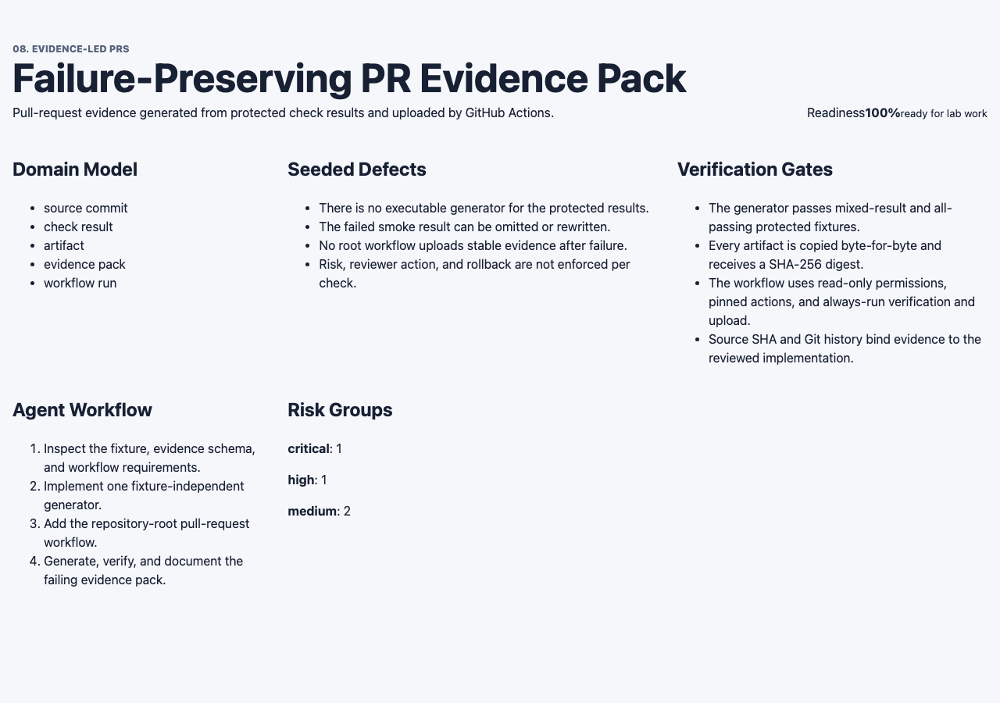
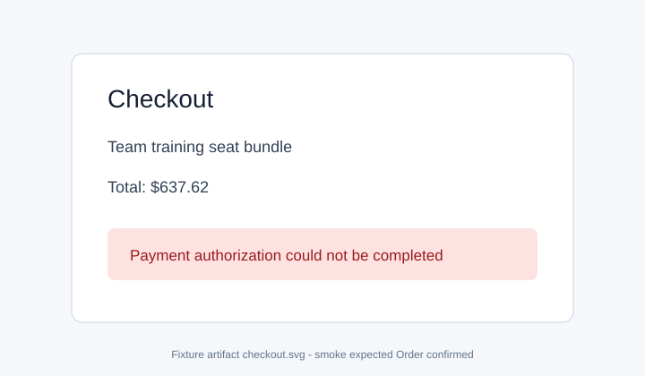
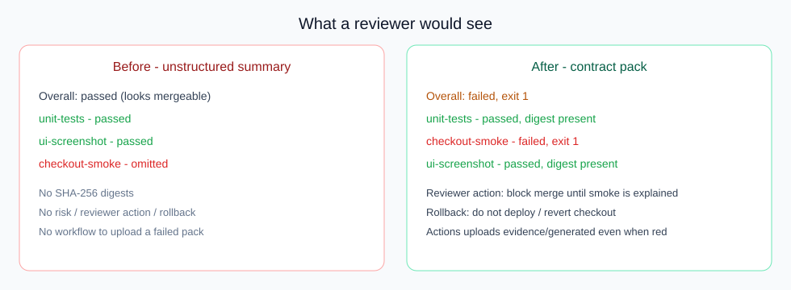
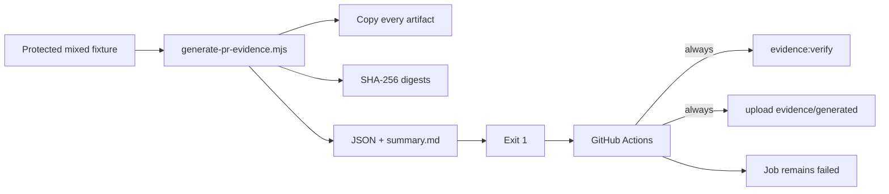
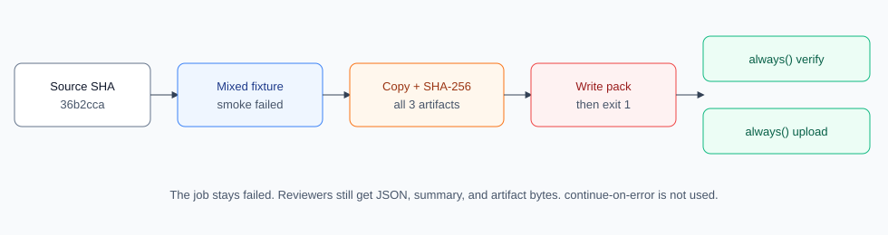
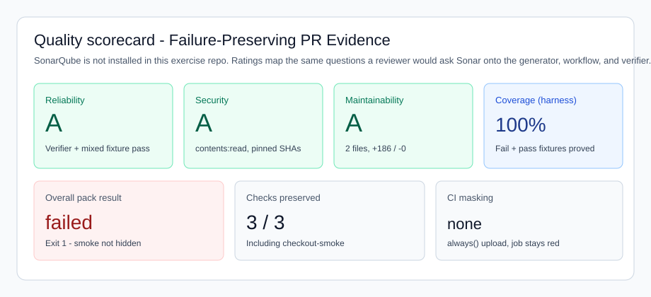

# Reviewer guide — 8.1 Failure-Preserving PR Evidence Pack

Start here if you are reviewing this PR as a human. Raw JSON is in `evidence/generated/`. This page explains **what was built**, **what to look at**, and **what “good” looks like**.

## What this PR is

A mixed CI fixture has a **failed checkout smoke** plus passing unit tests and a UI screenshot. A naive summary can look green by omitting the smoke failure. This PR:

1. Generates a complete evidence pack from the protected fixture (every check, artifact, SHA-256 digest, risk, reviewer action, and rollback).
2. Exits with the fixture’s original status (`1` when smoke failed) so the job cannot look green.
3. Uploads that pack from GitHub Actions even when generation is non-zero (`if: always()`, no `continue-on-error`).

## What to look at in two minutes

| Question | Where to look | Expected |
|---|---|---|
| What product UI is this lab about? | [dashboard.png](./dashboard.png) | Evidence-pack lab: domain model, seeded defects, 100% readiness |
| Why must a reviewer block merge? | [checkout-failed.svg](./checkout-failed.svg) and `../generated/artifacts/checkout-smoke.txt` | Payment authorization failed; expected heading was “Order confirmed” |
| Did the pack hide that failure? | [before-vs-after.svg](./before-vs-after.svg) and `../generated/summary.md` | Overall **failed**, exit **1**, `checkout-smoke` listed |
| How does CI keep the failure honest? | [flow.svg](./flow.svg) and `.github/workflows/evidence-led-pr-01.yml` | Generate → always verify → always upload; job stays red |
| Is evidence bound to the code you are reviewing? | Source SHA `36b2ccae737564f84c45790465053ed99d9b1f02` | Later commits are `evidence/` only |

## Visuals

### Lab dashboard



This is the production build of `pr-evidence-app`. The work under review is the generator and workflow, not a checkout-product rewrite.

### The check a green summary would hide



Fixture smoke output:

```
FAIL checkout-smoke
Expected confirmation heading: Order confirmed
Received alert: Payment authorization could not be completed
Exit code: 1
```

Unit tests and the screenshot **passed**. They do not authorize merge.

### Naive summary vs honest pack





### How the pack and workflow decide



### Quality scorecard

SonarQube is **not** configured in this exercise repository (no scanner project, no server). The scorecard maps the same reviewer questions to the gates this PR already runs.



| Sonar-style question | Evidence in this PR | Result |
|---|---|---|
| Reliability — does it work? | Mixed fixture exits `1`; all-passing fixture exits `0`; `npm run verify:exercise` | Pass |
| Security — secrets / unsafe CI? | `contents: read` only, pinned action SHAs, no repository secrets | Pass |
| Maintainability — is the diff reviewable? | Generator + workflow, `+186 / -0` at source SHA | Pass |
| Honesty of the gate | Smoke failure, digest, risk, reviewer action, and rollback are all present | Pass |

## How to reproduce

```bash
cd "08 Evidence-led PRs/exercise-01-pr-evidence-pack-automation/pr-evidence-app"
npm ci
npm run verify:exercise
```

Do not hand-edit `evidence/generated/`. Those files are generated from the source SHA.

## Reviewer decision

Approve the implementation if:

- `checkout-smoke` is failed with exit `1` in JSON and Markdown, and overall exit is `1`.
- All three artifacts exist with SHA-256 digests matching the fixture.
- The workflow is read-only, pinned, uploads on `always()`, and does not use `continue-on-error`.
- Negative controls still fail (path escape and result mismatch do not write a pack).
