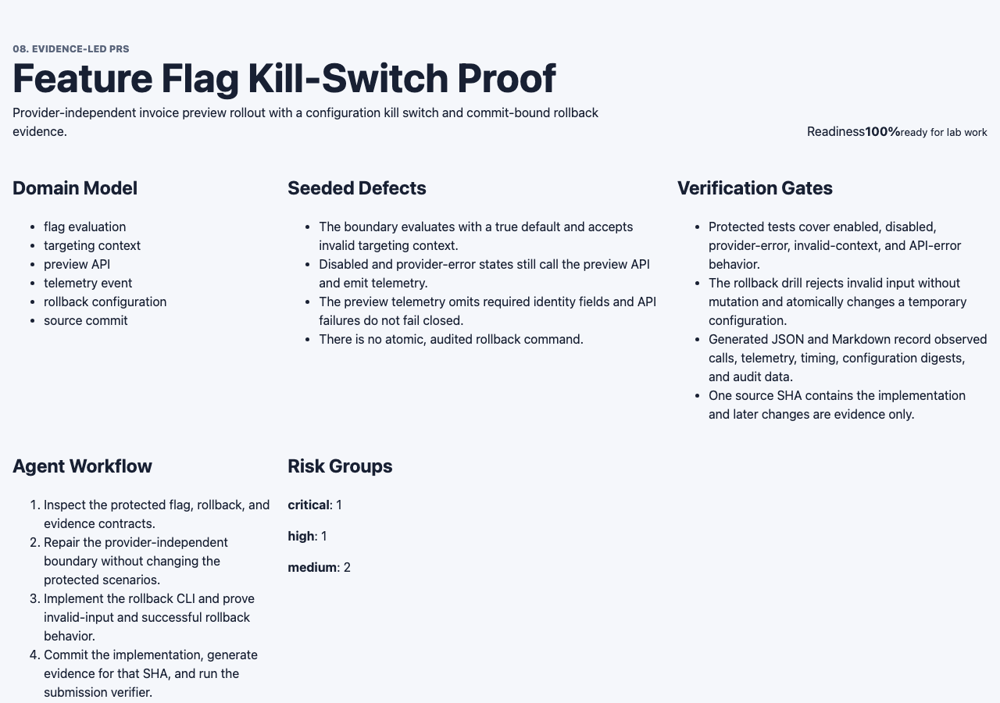
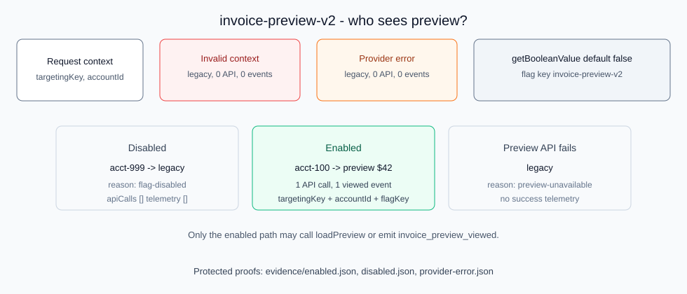
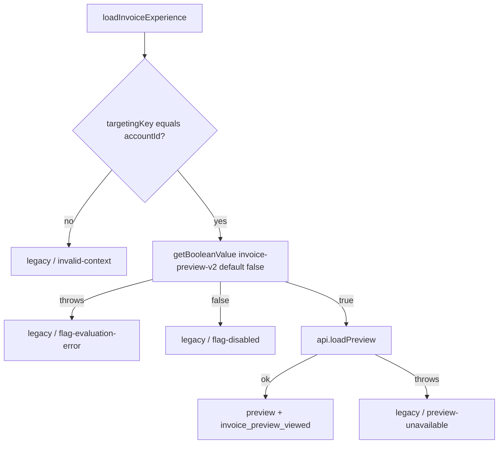
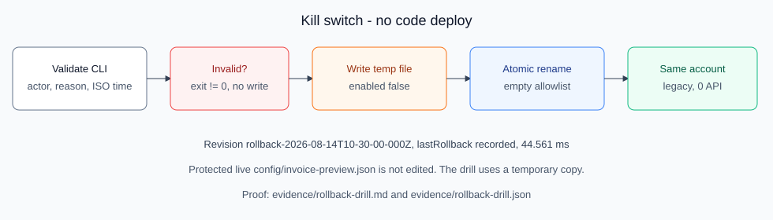
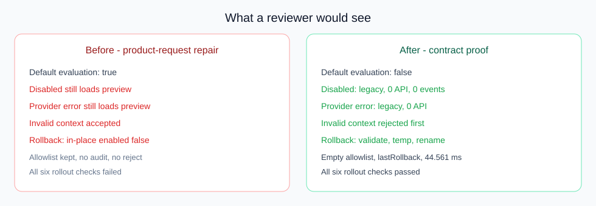
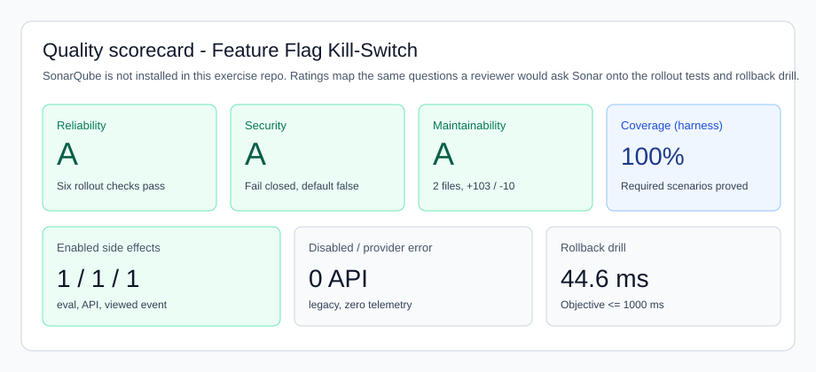

# Reviewer guide — 8.2 Feature Flag Kill-Switch Proof

Start here if you are reviewing this PR as a human. Generated JSON is in `evidence/enabled.json`, `disabled.json`, `provider-error.json`, and `rollback-drill.*`. This page explains **what was built**, **what to look at**, and **what “good” looks like**.

## What this PR is

Invoice preview (`invoice-preview-v2`) used to fail open: a disabled flag or a provider error could still call the preview API. This PR:

1. Evaluates the flag with a **safe `false` default** and rejects mismatched targeting before any evaluation.
2. Calls the preview API and emits `invoice_preview_viewed` **only** on the enabled path.
3. Adds an **atomic rollback command** that disables the flag without a deployment, then proves the same account gets the legacy experience.

## What to look at in two minutes

| Question | Where to look | Expected |
|---|---|---|
| What product is this lab? | [dashboard.png](./dashboard.png) | Kill-switch lab: domain model, seeded defects, 100% readiness |
| When is preview allowed? | [flag-states.svg](./flag-states.svg) | Only enabled + valid `targetingKey === accountId` |
| What happens if we kill the flag? | [rollback-flow.svg](./rollback-flow.svg) and `../rollback-drill.md` | Preview → legacy, 0 API calls, 44.561 ms, no deploy |
| Did the naive fix still leak preview? | [before-vs-after.svg](./before-vs-after.svg) | Before loaded preview when disabled; after does not |
| Is evidence bound to the code you are reviewing? | Source SHA `803ab79345e5d1b3ca863d96966bcbcd9ebf8295` | Later commits are `evidence/` only |

## Visuals

### Lab dashboard



This is the production build of `feature-flag-app`. The work under review is the rollout boundary and rollback CLI.

### Flag states a reviewer must understand





C, E, and F make **zero** preview API calls and **zero** `invoice_preview_viewed` events.

### Kill switch without a deploy



Drill result from `evidence/rollback-drill.md`:

- Before: enabled, 1 API call, 1 `invoice_preview_viewed`
- After: disabled, empty allowlist, revision `rollback-2026-08-14T10-30-00-000Z`, 0 API calls, 0 telemetry
- Elapsed **44.561 ms** (objective 1000 ms)
- Invalid timestamp: non-zero exit, config bytes unchanged

### Naive repair vs kill-switch proof



### Quality scorecard

SonarQube is **not** configured in this exercise repository (no scanner project, no server). The scorecard maps the same reviewer questions to the gates this PR already runs.



| Sonar-style question | Evidence in this PR | Result |
|---|---|---|
| Reliability — does it work? | `npm run verify:exercise`; six rollout checks | Pass |
| Security — fail closed? | Default `false`; provider error → legacy, no API | Pass |
| Maintainability — is the diff reviewable? | Boundary + rollback CLI, `+103 / -10` | Pass |
| Rollback SLO | Drill **44.561 ms**, atomic write+rename | Pass (<= 1000 ms) |

## How to reproduce

```bash
cd "08 Evidence-led PRs/exercise-02-feature-flag-rollback-proof/feature-flag-app"
npm ci
npm run verify:exercise
```

Do not hand-edit `evidence/enabled.json`, `disabled.json`, `provider-error.json`, or `rollback-drill.*`. Those files are generated from the source SHA.

## Reviewer decision

Approve the implementation if:

- Enabled `acct-100` is one evaluation, one API call, one `invoice_preview_viewed` with identity fields.
- Disabled and provider-error are legacy with empty `apiCalls` and `telemetry`.
- Rollback validates first, then atomically disables without a code deploy.
- Invalid input leaves the configuration unchanged.
