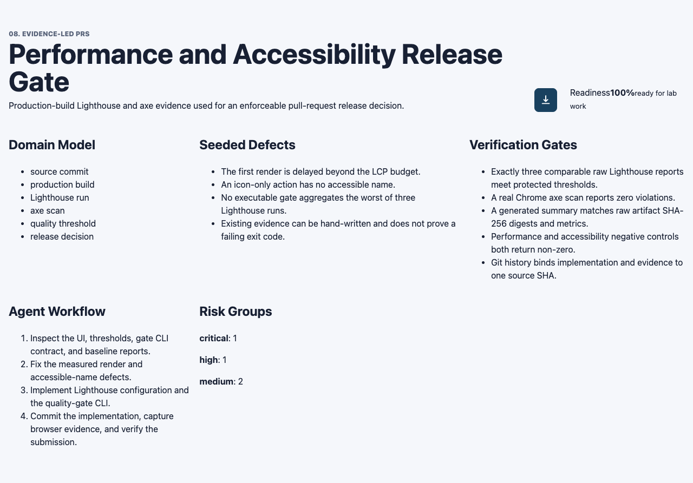
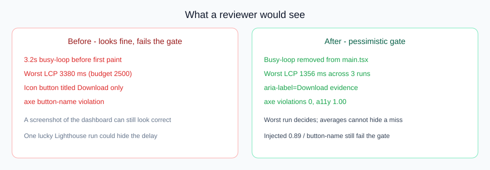
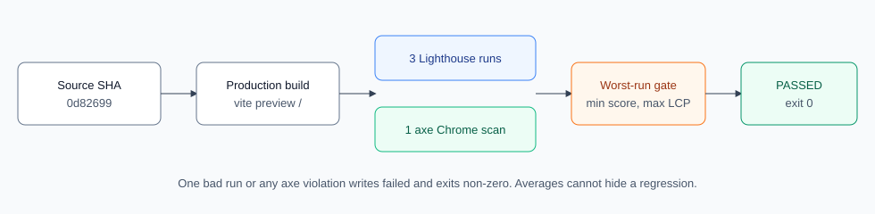
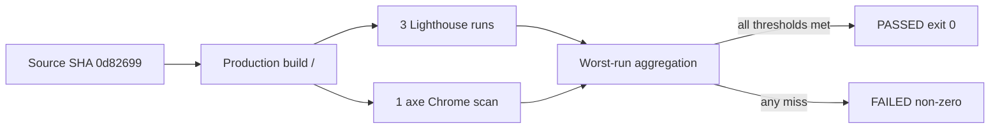
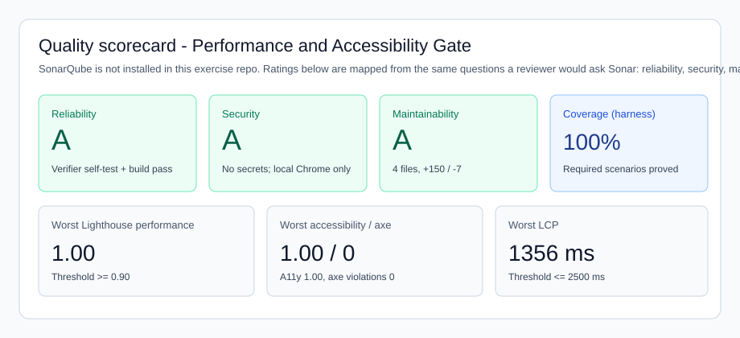

# Reviewer guide — 8.3 Performance and Accessibility Release Gate

Start here if you are reviewing this PR as a human. Raw JSON is in `evidence/raw/`. This page explains **what was built**, **what to look at**, and **what “good” looks like**.

## What this PR is

The dashboard could look correct while still being too slow to paint and while an icon button had no accessible name. This PR:

1. Removes a 3.2s main-thread block so first paint is inside the LCP budget.
2. Gives the icon-only control an accessible name (`aria-label="Download evidence"`).
3. Adds a **pessimistic** quality gate: three production Lighthouse runs plus one Chrome axe scan. The **worst** run decides. One bad run cannot be averaged away.

## What to look at in two minutes

| Question | Where to look | Expected |
|---|---|---|
| Does the UI still look like the lab dashboard? | [dashboard.png](./dashboard.png) | Header, domain model, seeded defects, 100% readiness |
| Is the download control named? | Same screenshot, icon button next to Readiness | `aria-label="Download evidence"` in `src/App.tsx` |
| Did performance actually improve? | [quality-scorecard.svg](./quality-scorecard.svg) and `../quality-summary.json` | Worst LCP **1356 ms** (was 3380 ms) |
| What changed vs a visual-only pass? | [before-vs-after.svg](./before-vs-after.svg) | Delay gone, named button, worst-run gate |
| Can one bad run still fail the gate? | [flow.svg](./flow.svg) and `../commands/quality-verify.txt` | Injected 0.89 performance and a `button-name` violation both exit non-zero |
| Is evidence bound to the code you are reviewing? | Source SHA `0d826991ec491eecc0b29688311a87634be9848d` | Later commits are `evidence/` only |

## Visuals

### Dashboard under test



This is the production build at `/`. The download icon is the control that previously failed axe `button-name`.

### Naive visual pass vs pessimistic gate



### How the gate decides





### Quality scorecard

SonarQube is **not** configured in this exercise repository (no scanner project, no server). The scorecard maps the same reviewer questions to the gates this PR already runs.



| Sonar-style question | Evidence in this PR | Result |
|---|---|---|
| Reliability — does it work? | `npm run verify:exercise` | Pass |
| Security — secrets / unsafe CI? | Local Chrome capture only; no repository secrets | Pass |
| Maintainability — is the diff reviewable? | 4 implementation files, `+150 / -7` | Pass |
| Performance | Worst Lighthouse performance **1.00**, LCP **1356 ms** | Pass (>= 0.90, <= 2500 ms) |
| Accessibility | Lighthouse a11y **1.00**, axe violations **0** | Pass |

## How to reproduce

```bash
cd "08 Evidence-led PRs/exercise-03-performance-and-a11y-evidence-gate/quality-gate-app"
npm ci
npm run verify:exercise
```

Do not hand-edit `evidence/raw/` or `evidence/comparison.md`. Those files are generated from the source SHA.

## Reviewer decision

Approve the implementation if:

- The delay is gone from `src/main.tsx`.
- The icon button has an accessible name.
- Three raw Lighthouse reports and one axe scan are present and the summary says **passed**.
- Negative controls still fail (proved in `quality-verify.txt`).
